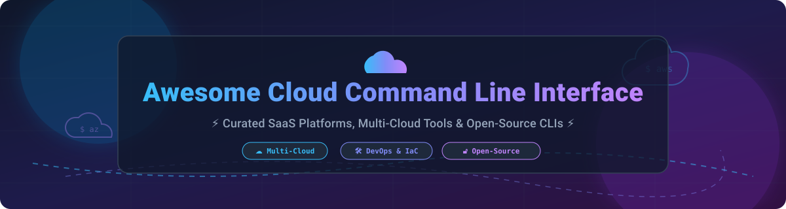

# ⚡ Awesome Cloud Command-Line Interface (Cloud CLI) ☁️

  
  
  
  

> 🚀 **Curated List of Cloud CLI Tools, Multi-Cloud Terminal Utilities, SaaS Cloud Management Platforms & Open-Source Infrastructure Projects**
>
> *Focused on Cloud Infrastructure Automation, Multi-Cloud Operations, Container Management & Terminal Workflows.*
>
> 📅 **Last updated: October 2026**

---

## 💡 Overview & SEO Keywords

Welcome to the ultimate directory of **Cloud Command-Line Interfaces (CLIs)**! Whether you are a DevOps engineer, Site Reliability Engineer (SRE), cloud architect, or software developer, this repository provides a comprehensive breakdown of production-grade terminal tools for managing infrastructure across Amazon Web Services (AWS), Microsoft Azure, Google Cloud Platform (GCP), Oracle Cloud Infrastructure (OCI), DigitalOcean, Akamai/Linode, Vultr, IBM Cloud, Scaleway, and Alibaba Cloud.

### 🔍 Key Topics & Categories
- ☁️ **Major Cloud Provider CLIs**: Universal tools like `aws-cli`, `azure-cli`, `gcloud`, `oci-cli`, `doctl`, and `aliyun-cli`.
- 🛠️ **Infrastructure as Code (IaC) & Developer CLIs**: Command-line developer tools like `pulumi`, `azd` (Azure Developer CLI), and `copilot-cli`.
- 📦 **Container & Kubernetes Terminal Tools**: Tools for managing cluster deployments and containerized workflows directly from your shell.
- ⚙️ **Multi-Cloud Operations**: Automation utilities for managing resources across public, private, and hybrid cloud environments.

---

## 📖 Table of Contents

- [☁️ SaaS / Hosted Cloud Platforms](#️-saas--hosted-cloud-platforms)
- [🔓 Open-Source GitHub Projects](#-open-source-github-projects)
- [🤝 How to Contribute](#-how-to-contribute)
- [💖 Support & Sponsorship](#-support--sponsorship)
- [⚠️ Disclaimer](#️-disclaimer)
- [📊 Star History](#-star-history)

---

## ☁️ SaaS / Hosted Cloud Platforms

> **📊 Market Context & Size**: The global cloud infrastructure services market is estimated at **~$1.2 Trillion in 2026**, growing at **~18% CAGR**. The cloud CLI sector is **highly concentrated** around major cloud hyperscalers (AWS, Microsoft Azure, Google Cloud, and Oracle) who distribute CLI tools as free value-adds to drive platform adoption. No CLI tool holds a standalone "winner-take-all" commercial position; instead, enterprises typically standardize on their primary cloud provider's official CLI alongside Infrastructure-as-Code (IaC) tools like Pulumi or OpenTofu.

The table below lists major cloud management platforms sorted by **Company Size (Revenue / Valuation) in descending order**:

| Platform | Description | Pricing (Starting Tier) | Free Tier Limits | Company Size (Revenue / Valuation) |
| :--- | :--- | :--- | :--- | :--- |
| **[AWS CLI](https://aws.amazon.com/cli/)** ☁️ | Unified CLI for AWS services. v2 is the current generation with installer-based distribution. Open-source on GitHub. | **Free CLI** (Pay for resources). Compute starts at **$0.0034/hr** (t4g.nano). | **AWS Free Plan**: **$100 sign-up credits** + 6 months free access. **Always Free**: 1M Lambda requests/mo, 5GB S3, 750 hrs EC2 t2/t3.micro (12 mos). | **~$638B revenue (Amazon FY2025)** |
| **[Google Cloud CLI (gcloud)](https://cloud.google.com/sdk/gcloud)** 🌐 | CLI for Google Cloud. Includes `gcloud`, `gsutil`, and `bq` tools. Free for all Google Cloud users. | **Free CLI** (Pay for resources). Compute starts at **$0.0076/hr** (e2-micro). | **Google Cloud Free Tier**: **$300 credit (90 days)** + 20+ always-free products (1 e2-micro VM, 5GB Cloud Storage, 1TiB BigQuery/mo). | **~$350B revenue (Alphabet FY2025)** |
| **[Microsoft Azure CLI](https://learn.microsoft.com/en-us/cli/azure/)** 🔷 | Cross-platform CLI for managing Azure resources. Available on Windows, macOS, Linux, Docker, and Azure Cloud Shell. | **Free CLI** (Pay for resources). Compute starts at **$0.0052/hr** (B1ls). | **Azure Free Account**: **$200 credit for 30 days** + 12 months of popular free services + 55+ always-free services. Azure Cloud Shell includes 5GB free. | **~$281B revenue (Microsoft FY2025)** |
| **[Alibaba Cloud CLI](https://www.alibabacloud.com/help/en/cli)** 🇨🇳 | Official CLI for Alibaba Cloud infrastructure services and Cloud Shell. | **Free CLI** (Pay for resources). Basic ECS starts at **$4.50/month**. | **Free Trial**: Up to **$300-$1700 credit / 30-90 days** in trial resources for compute, storage, and AI for verified new users. | **~$130B revenue (Alibaba FY2025 est.)** |
| **[IBM Cloud CLI](https://cloud.ibm.com/docs/cli)** 🏢 | Command-line tool suite for administering IBM Cloud services and infrastructure. | **Free CLI** (Pay for resources). Pay-As-You-Go with standard usage rates. | **IBM Cloud Lite Account**: **$200 credit for 30 days** for new accounts + always-free Lite plan services (no credit card required). | **~$63B revenue (IBM FY2025)** |
| **[OCI CLI](https://docs.oracle.com/en-us/iaas/Content/API/Concepts/cliconcepts.htm)** 🧅 | Oracle Cloud Infrastructure CLI. Available in Cloud Shell (pre-installed) and as standalone package. | **Free CLI** (Pay for resources). Compute starts at **$0.0075/hr**. | **Oracle Always Free**: 2 Autonomous Databases, 4 Arm Ampere A1 cores + 24GB RAM, 200GB block storage, 10TB outbound data/mo indefinitely. | **~$53B revenue (Oracle FY2025)** |
| **[Linode CLI](https://www.linode.com/docs/guides/linode-cli/)** ⚡ | CLI wrapper around Linode API for managing Akamai Cloud Computing resources. | **Free CLI** (Pay for resources). Linode instances start at **$5.00/month** (Nanode 1GB). | **$100 credit for 60 days** for new accounts. No perpetual free compute tier. | **Part of Akamai (~$4B+ revenue)** |
| **[DigitalOcean CLI (doctl)](https://github.com/digitalocean/doctl)** 🌊 | Official CLI for DigitalOcean. Go-based, cross-platform CLI tool. | **Free CLI** (Pay for resources). Droplets start at **$4.00/month** (Basic Droplet). | **$200 credit for 60 days** for new accounts. No perpetual free compute tier. | **Public (DOCN), ~$700M+ revenue** |
| **[Vultr CLI](https://docs.vultr.com/)** 🔌 | Official CLI for managing Vultr instances, storage, and networking. | **Free CLI** (Pay for resources). Instances start at **$2.50/month** (IPv6-only) or **$5.00/month** (IPv4). | **$100–$300 credit for 14–30 days** for new promotional accounts. No perpetual free compute tier. | **Private (~$500M+ revenue est.)** |
| **[Scaleway CLI](https://github.com/scaleway/scaleway-cli)** 🇪🇺 | CLI for administering Scaleway Cloud accounts and European cloud infrastructure. | **Free CLI** (Pay for resources). Instances start at **€0.0045/hour** (~€3.24/month). | **€100 credit for 30 days** for new accounts. No perpetual free compute tier. | **Private (part of Iliad Group, ~$10B+ group rev)** |

---

## 🔓 Open-Source GitHub Projects

Below is a curated collection of open-source cloud CLI tools, developer frameworks, and multi-cloud command-line interfaces, sorted by **GitHub Stars_Count (descending)**:

| Repo | Description | GitHub_Stars |
| :--- | :--- | :--- |
| **[Pulumi](https://github.com/pulumi/pulumi)** 🚀 | Infrastructure as Code in TypeScript, Python, Go, C#, Java, and YAML. Multi-cloud deployment CLI. Apache-2.0. |  |
| **[AWS CLI](https://github.com/aws/aws-cli)** 📦 | Universal Command Line Interface for Amazon Web Services. v2 is the current Python-based generation. Apache-2.0. |  |
| **[Azure CLI](https://github.com/Azure/azure-cli)** 🔷 | Official command-line tools for Microsoft Azure. Cross-platform, Python-based. MIT License. |  |
| **[Google Cloud SDK](https://github.com/google-cloud-sdk/google-cloud-sdk)** 🌐 | Official command-line SDK for Google Cloud including `gcloud`, `gsutil`, and `bq`. |  |
| **[doctl (DigitalOcean CLI)](https://github.com/digitalocean/doctl)** 🌊 | Official DigitalOcean CLI. Go-based binary available on macOS, Linux, and Windows. Apache-2.0. |  |
| **[AWS Copilot CLI](https://github.com/aws/copilot-cli)** ⛵ | Developer CLI for building, releasing, and operating containerized apps on AWS App Runner & ECS/Fargate. Apache-2.0. |  |
| **[Azure Developer CLI (azd)](https://github.com/Azure/azure-dev)** 🛠️ | Developer-centric CLI for Azure that accelerates app provisioning, coding, and deployment. MIT. |  |
| **[Scaleway CLI](https://github.com/scaleway/scaleway-cli)** 🇪🇺 | Command-line interface for Scaleway Cloud infrastructure. Go-based. Apache-2.0. |  |
| **[Alibaba Cloud CLI](https://github.com/aliyun/aliyun-cli)** 🇨🇳 | Official Alibaba Cloud CLI (`aliyun`). Go-based tool for managing cloud resources. Apache-2.0. |  |
| **[OCI CLI](https://github.com/oracle/oci-cli)** 🧅 | Official Oracle Cloud Infrastructure CLI. Python-based tool. Universal Permissive License (UPL) 1.0. |  |
| **[Linode CLI](https://github.com/linode/linode-cli)** ⚡ | Official CLI for Linode / Akamai Cloud Computing services. Python-based. Apache-2.0. |  |
| **[IBM Cloud CLI](https://github.com/IBM-Cloud/ibm-cloud-cli-release)** 🏢 | Command-line environment release for IBM Cloud (`ibmcloud`). Go-based. Apache-2.0. |  |
| **[Vultr CLI](https://github.com/vultr/vultr-cli)** 🔌 | Official Vultr CLI (`vultr-cli`) written in Go for managing compute, storage, and DNS. Apache-2.0. |  |

---

## 🤝 How to Contribute

Contributions are warmly welcomed! Help us keep this list up to date and expand coverage of cloud CLI tools.

1. 🍴 **Fork** this repository.
2. 📝 Add or update entries in `README.md` following the tabular format.
3. 📌 Ensure descriptions are concise, factual, and include proper pricing / free-tier details.
4. 🔀 Submit a **Pull Request** with a brief summary of changes.

---

## 💖 Support & Sponsorship

If you found this list helpful, please consider supporting the project:

- ⭐️ **Star** this repository on GitHub to increase visibility!
- 🔀 **Fork** and share with your DevOps team or developer community.
- ☕ **Buy me a coffee / Sponsor**: Support ongoing maintenance on GitHub Sponsors:

  

Thank you for supporting open-source software! ❤️

---

## ⚠️ Disclaimer

- This is a **community-curated** list — not exhaustive and not an official endorsement of any listed cloud vendor.
- Cloud CLIs handle sensitive API tokens and credentials; always enforce proper secret management, least-privilege IAM policies, and organization security guidelines.
- **Open-source nature of Cloud CLIs**: Nearly all cloud provider CLIs (`aws-cli`, `azure-cli`, `gcloud`, `doctl`, `oci-cli`, `vultr-cli`, `scaleway-cli`, etc.) are released under open-source licenses (Apache-2.0, MIT, UPL). The SaaS table describes the hosted cloud services managed by the CLI, while the Open-Source table highlights the command-line tools themselves.
- **Pricing & Free Tier Terms**: Free tier quotas and promotional credits are accurate as of October 2026 but are subject to change by cloud providers. Always consult official vendor pricing pages before launching production workloads.

---

## 📊 Star History

---

  <b>Made with ❤️ for DevOps Engineers, Cloud Architects, Platform Teams &amp; Infrastructure Developers.</b>

